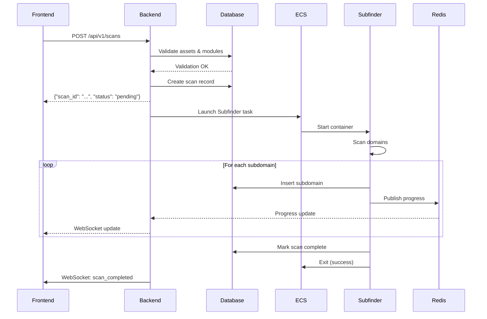
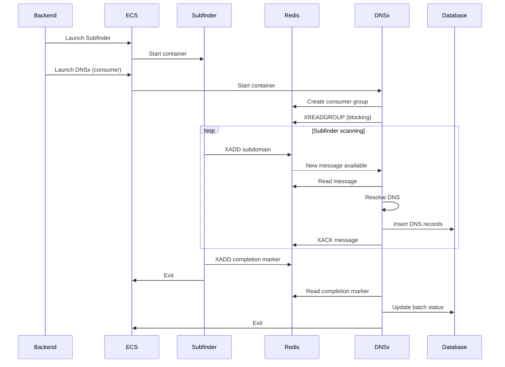
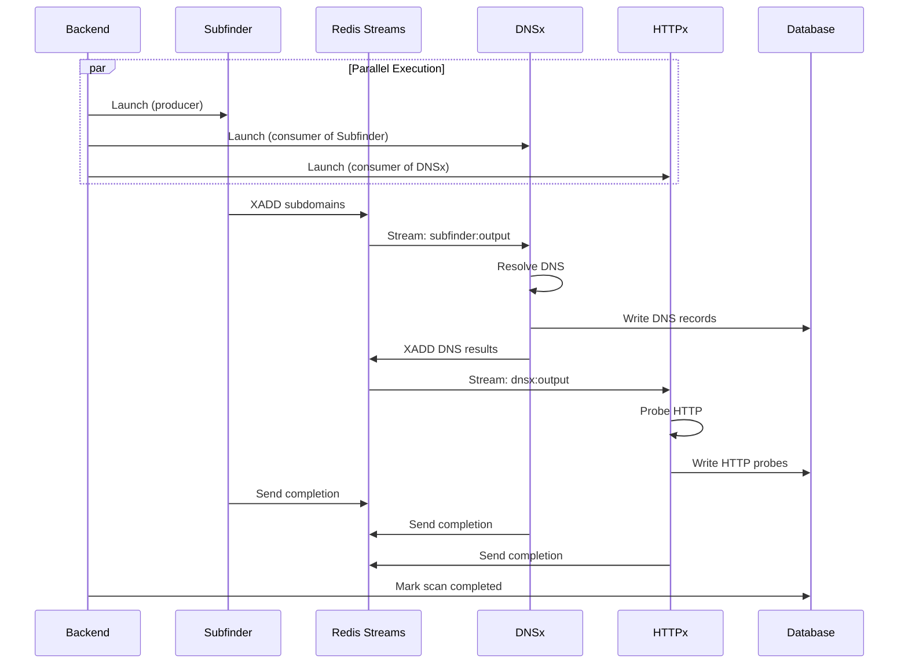

# Data Flow & Streaming Protocol

**Request Lifecycle and Communication Patterns**

---

## Table of Contents

1. [Request Lifecycle](#request-lifecycle)
2. [Redis Streams Protocol](#redis-streams-protocol)
3. [Database Persistence Patterns](#database-persistence-patterns)
4. [Module Communication](#module-communication)
5. [WebSocket Real-Time Updates](#websocket-real-time-updates)
6. [Sequence Diagrams](#sequence-diagrams)
7. [Protocol Specifications](#protocol-specifications)

---

## Request Lifecycle

### Overview

A scan request flows through **7 distinct phases** from API call to completed results:

```
1. API Request (Frontend → Backend)
2. Validation (Backend → Database)
3. Orchestration (Backend → ScanPipeline)
4. Resource Allocation (Backend → ResourceCalculator)
5. ECS Launch (Backend → AWS ECS)
6. Module Execution (ECS → Redis/Database)
7. Completion & Cleanup (Backend → Database → Frontend)
```

### Phase 1: API Request

**Endpoint**: `POST /api/v1/scans`

**Request Payload**:
```json
{
  "asset_ids": ["6f58e77d-b8ee-44a3-9e5e-7787db5e4e2e"],
  "modules": ["subfinder", "dnsx", "httpx"],
  "active_domains_only": true
}
```

**Backend Processing** (`backend/app/api/v1/scans.py`):
```python
@router.post("/", response_model=ScanResponse)
async def create_scan(
    request: ScanRequest,
    current_user: User = Depends(get_current_user)
):
    # 1. Validate request schema (Pydantic)
    # 2. Check user permissions
    # 3. Delegate to ScanOrchestrator
    
    scan_id = await scan_orchestrator.execute_scan(
        asset_ids=request.asset_ids,
        modules=request.modules,
        user_id=current_user.id,
        active_domains_only=request.active_domains_only
    )
    
    return ScanResponse(scan_id=scan_id, status="pending")
```

**Response** (< 2 seconds):
```json
{
  "scan_id": "3f8e1a2b-4c5d-6e7f-8a9b-0c1d2e3f4a5b",
  "status": "pending",
  "created_at": "2025-11-19T12:34:56Z"
}
```

### Phase 2: Validation

**ScanOrchestrator** validates:

1. **Assets exist** and belong to user
2. **Modules are active** in `scan_module_profiles`
3. **Dependencies satisfied** (e.g., HTTPx requires DNSx)
4. **Domains available** (at least one apex domain)

**Database Queries**:
```sql
-- Check assets
SELECT id, name FROM assets 
WHERE id = ANY($1) AND user_id = $2 AND is_active = true;

-- Validate modules
SELECT module_name, dependencies, is_active 
FROM scan_module_profiles 
WHERE module_name = ANY($1) AND is_active = true;

-- Count domains
SELECT COUNT(*) FROM apex_domains 
WHERE asset_id = ANY($1) AND is_active = true;
```

**Error Handling**:
- `AssetNotFound` → HTTP 404
- `ModuleInactive` → HTTP 400
- `NoDomains` → HTTP 400

### Phase 3: Orchestration

**ScanPipeline** resolves execution order:

```python
# Input: ["httpx", "subfinder"]
# Pipeline resolves: ["subfinder", "dnsx", "httpx"]
#   - subfinder first (dependency of dnsx)
#   - dnsx auto-included (persistence layer)
#   - httpx last (depends on dnsx)

execution_order = pipeline._resolve_execution_order(modules)
```

**Decision Logic**:
```python
if len(modules) > 1 and has_dependencies(modules):
    # Sequential execution with dependency chaining
    await scan_pipeline.execute_pipeline(...)
else:
    # Single module or parallel execution
    await batch_workflow_orchestrator.execute_scan(...)
```

### Phase 4: Resource Allocation

**ResourceCalculator** determines CPU/memory:

```python
# For each module:
domain_count = len(domains)
module_profile = await module_registry.get_module(module_name)

resources = resource_calculator.calculate_resources(
    module_profile, 
    domain_count
)

# Result:
# {
#   "cpu": 512,
#   "memory": 1024,
#   "estimated_duration_minutes": 5,
#   "description": "Medium workload"
# }
```

**Batch Optimization** (if domain_count > max_batch_size):
```python
# Split 450 domains into batches
batches = batch_optimizer.optimize_batches(
    module_profile,
    domains=450
)
# Returns: [200, 200, 50] → 3 ECS tasks instead of 450
```

### Phase 5: ECS Launch

**BatchWorkflowOrchestrator** launches ECS tasks:

```python
response = ecs_client.run_task(
    cluster='neobotnet-v2-dev-cluster',
    taskDefinition=module_profile.task_definition_template,
    launchType='FARGATE',
    overrides={
        'cpu': str(allocated_cpu),
        'memory': str(allocated_memory),
        'containerOverrides': [{
            'name': container_name,
            'environment': [
                {'name': 'SCAN_JOB_ID', 'value': scan_job_id},
                {'name': 'DOMAINS', 'value': json.dumps(domains)},
                {'name': 'STREAMING_MODE', 'value': 'true'},
                {'name': 'STREAM_OUTPUT_KEY', 'value': f'scan:{scan_job_id}:{module}:output'}
            ]
        }]
    }
)

ecs_task_arn = response['tasks'][0]['taskArn']
```

**Task States**:
- `PROVISIONING` → Container image pulling
- `PENDING` → Waiting for resources
- `RUNNING` → Module executing
- `STOPPED` → Completed or failed

### Phase 6: Module Execution

**Module** (Subfinder example):

```go
func (s *Scanner) Run() error {
    for _, domain := range s.config.Domains {
        // Scan domain
        results, _ := s.scanDomain(domain)
        
        // Stream to Redis
        for _, result := range results {
            s.redisClient.XAdd(ctx, &redis.XAddArgs{
                Stream: s.config.StreamOutputKey,
                Values: map[string]interface{}{
                    "subdomain": result.Subdomain,
                    "parent_domain": result.ParentDomain,
                    // ... more fields
                },
            })
        }
    }
    
    // Send completion marker
    s.sendCompletionMarker(totalSubdomains)
    return nil
}
```

**Parallel Consumer** (DNSx reads Subfinder's stream):

```go
// DNSx starts immediately, consuming as Subfinder produces
for {
    streams, _ := redisClient.XReadGroup(ctx, &redis.XReadGroupArgs{
        Group: "dnsx-consumers",
        Consumer: "dnsx-task-abc",
        Streams: []string{"scan:3f8e1a2b:subfinder:output", ">"},
    }).Result()
    
    for _, message := range streams[0].Messages {
        subdomain := parseSubdomain(message.Values)
        dnsRecords := resolveDNS(subdomain)
        supabaseClient.InsertDNSRecords(dnsRecords)
    }
    
    if completionMarkerReceived() {
        break
    }
}
```

### Phase 7: Completion & Cleanup

**Backend monitoring** polls scan status:

```python
async def monitor_scan(scan_id: str):
    while True:
        scan = await get_scan_status(scan_id)
        
        if scan.status in ['completed', 'failed', 'cancelled']:
            # Update final status
            await update_scan_completion(scan_id, scan.status)
            
            # Cleanup Redis streams (24h TTL)
            await redis.expire(f'scan:{scan_id}:*:output', 86400)
            
            # Notify via WebSocket
            await websocket_manager.broadcast(scan_id, {
                'type': 'scan_completed',
                'scan_id': scan_id,
                'status': scan.status
            })
            break
        
        await asyncio.sleep(10)  # Poll every 10 seconds
```

---

## Redis Streams Protocol

### Stream Architecture

**Producer → Stream → Consumer Pattern**:

```
Subfinder (Producer)
    ↓ XADD
Redis Stream: scan:3f8e1a2b:subfinder:output
    ↓ XREADGROUP
DNSx (Consumer Group: dnsx-consumers)
    ├─ Consumer 1: dnsx-task-abc
    ├─ Consumer 2: dnsx-task-def
    └─ Consumer 3: dnsx-task-ghi
```

### Message Structure

**Standard Message**:
```json
{
  "subdomain": "api.example.com",
  "parent_domain": "example.com",
  "source": "subfinder",
  "discovered_at": "2025-11-19T12:34:56.789Z",
  "scan_job_id": "3f8e1a2b-4c5d-6e7f-8a9b-0c1d2e3f4a5b",
  "asset_id": "6f58e77d-b8ee-44a3-9e5e-7787db5e4e2e"
}
```

**Completion Marker**:
```json
{
  "type": "completion",
  "module": "subfinder",
  "scan_job_id": "3f8e1a2b-4c5d-6e7f-8a9b-0c1d2e3f4a5b",
  "timestamp": "2025-11-19T12:35:00.000Z",
  "total_results": 247
}
```

### Producer Implementation

**XADD Command**:
```go
// Streaming individual results
_, err := redisClient.XAdd(ctx, &redis.XAddArgs{
    Stream: "scan:3f8e1a2b:subfinder:output",
    MaxLen: 10000,  // Trim to prevent memory issues
    Approx: true,   // ~ for performance
    Values: map[string]interface{}{
        "subdomain": "api.example.com",
        "parent_domain": "example.com",
        "source": "subfinder",
        "discovered_at": time.Now().UTC().Format(time.RFC3339Nano),
        "scan_job_id": "3f8e1a2b-4c5d-6e7f-8a9b-0c1d2e3f4a5b",
        "asset_id": "6f58e77d-b8ee-44a3-9e5e-7787db5e4e2e",
    },
}).Result()
```

**Batch XADD** (for performance):
```go
// Buffer messages for bulk insert
buffer := make([]redis.XAddArgs, 0, 100)

for _, subdomain := range results {
    buffer = append(buffer, redis.XAddArgs{
        Stream: streamKey,
        Values: serializeSubdomain(subdomain),
    })
    
    if len(buffer) >= 100 {
        pipeline := redisClient.Pipeline()
        for _, args := range buffer {
            pipeline.XAdd(ctx, &args)
        }
        pipeline.Exec(ctx)
        buffer = buffer[:0]  // Clear buffer
    }
}
```

### Consumer Implementation

**Consumer Group Creation**:
```go
// Create consumer group (idempotent)
err := redisClient.XGroupCreateMkStream(ctx,
    "scan:3f8e1a2b:subfinder:output",
    "dnsx-consumers",
    "0"  // Start from beginning
).Err()

// BUSYGROUP error means group already exists (OK)
if err != nil && !strings.Contains(err.Error(), "BUSYGROUP") {
    return err
}
```

**XREADGROUP Loop**:
```go
for {
    // Read new messages (blocking)
    streams, err := redisClient.XReadGroup(ctx, &redis.XReadGroupArgs{
        Group:    "dnsx-consumers",
        Consumer: "dnsx-task-abc123",  // Unique per task
        Streams:  []string{"scan:3f8e1a2b:subfinder:output", ">"},
        Count:    50,  // Messages per read
        Block:    5 * time.Second,
    }).Result()
    
    if err == redis.Nil {
        continue  // No new messages
    }
    
    for _, stream := range streams {
        for _, message := range stream.Messages {
            // Check for completion
            if message.Values["type"] == "completion" {
                log.Println("Received completion marker")
                return nil
            }
            
            // Process message
            subdomain := parseSubdomain(message.Values)
            processSubdomain(subdomain)
            
            // Acknowledge (remove from pending)
            redisClient.XAck(ctx, stream.Stream, "dnsx-consumers", message.ID)
        }
    }
}
```

### Consumer Group Benefits

1. **Load Balancing**: Multiple consumers process in parallel
2. **Fault Tolerance**: Pending messages reassigned on consumer failure
3. **At-Least-Once Delivery**: Messages redelivered if not acknowledged

**Example** (3 DNSx consumers processing 1000 subdomains):
```
Consumer 1: Messages 1-333
Consumer 2: Messages 334-666
Consumer 3: Messages 667-1000
```

### Error Handling

**Dead Letter Queue Pattern**:
```go
// Check pending messages (unacknowledged)
pending, _ := redisClient.XPending(ctx, streamKey, consumerGroup).Result()

if pending.Count > 100 {
    // Too many pending, consumer may be stuck
    log.Warn("High pending count, checking for dead consumers")
    
    // Claim old pending messages
    messages, _ := redisClient.XAutoClaim(ctx, &redis.XAutoClaimArgs{
        Stream:   streamKey,
        Group:    consumerGroup,
        Consumer: myConsumerName,
        MinIdle:  5 * time.Minute,  // Claim messages idle > 5min
        Count:    10,
    }).Result()
    
    // Reprocess claimed messages
    for _, msg := range messages {
        processMessage(msg)
    }
}
```

---

## Database Persistence Patterns

### Pattern 1: Idempotent Upsert

**Problem**: Retries or multiple scans may discover same subdomain

**Solution**: `ON CONFLICT DO UPDATE`

```sql
-- Subdomain insertion with conflict resolution
INSERT INTO subdomains (
    subdomain, 
    parent_domain, 
    asset_id, 
    scan_job_id, 
    source_module, 
    discovered_at
) VALUES (
    $1, $2, $3, $4, $5, $6
)
ON CONFLICT (subdomain, asset_id) 
DO UPDATE SET
    last_checked = NOW(),
    scan_job_id = EXCLUDED.scan_job_id,
    source_module = EXCLUDED.source_module
RETURNING id;
```

**Benefits**:
- **Idempotent**: Running twice produces same result
- **Deduplication**: One record per subdomain per asset
- **Audit Trail**: Tracks last scan that found it

### Pattern 2: Bulk Insert with PostgreSQL Functions

**Problem**: 1000 individual INSERTs = slow, high connection overhead

**Solution**: Bulk insert via stored procedure

**Function Definition** (`database/migrations/bulk_insert_subdomains.sql`):
```sql
CREATE OR REPLACE FUNCTION bulk_insert_subdomains(records JSONB)
RETURNS TABLE(inserted INTEGER, skipped INTEGER) AS $$
DECLARE
    record JSONB;
    inserted_count INTEGER := 0;
    skipped_count INTEGER := 0;
BEGIN
    FOR record IN SELECT jsonb_array_elements(records)
    LOOP
        INSERT INTO subdomains (
            subdomain, parent_domain, asset_id, scan_job_id, source_module, discovered_at
        ) VALUES (
            record->>'subdomain',
            record->>'parent_domain',
            (record->>'asset_id')::UUID,
            (record->>'scan_job_id')::UUID,
            record->>'source_module',
            (record->>'discovered_at')::TIMESTAMPTZ
        )
        ON CONFLICT (subdomain, asset_id) DO NOTHING;
        
        IF FOUND THEN
            inserted_count := inserted_count + 1;
        ELSE
            skipped_count := skipped_count + 1;
        END IF;
    END LOOP;
    
    RETURN QUERY SELECT inserted_count, skipped_count;
END;
$$ LANGUAGE plpgsql;
```

**Module Usage** (`backend/containers/subfinder-go/database.go`):
```go
func (c *SupabaseClient) BulkInsertSubdomains(records []SubdomainRecord) error {
    payload := map[string]interface{}{"records": records}
    jsonData, _ := json.Marshal(payload)
    
    // Call PostgreSQL function via Supabase RPC
    req, _ := http.NewRequest("POST",
        fmt.Sprintf("%s/rest/v1/rpc/bulk_insert_subdomains", c.URL),
        bytes.NewBuffer(jsonData))
    
    req.Header.Set("apikey", c.ServiceKey)
    req.Header.Set("Authorization", "Bearer "+c.ServiceKey)
    
    resp, _ := c.HTTPClient.Do(req)
    // Handle response...
    
    return nil
}
```

**Performance**: 1000 records in ~500ms vs 30+ seconds for individual INSERTs

### Pattern 3: Transactional Updates

**Problem**: Scan status updates must be atomic

**Solution**: Database transactions

```sql
BEGIN;

-- Update scan status
UPDATE scans 
SET status = 'completed', 
    completed_at = NOW(), 
    completed_domains = $1
WHERE id = $2;

-- Update asset scan jobs
UPDATE asset_scan_jobs
SET status = 'completed',
    completed_at = NOW()
WHERE scan_id = $2;

COMMIT;
```

**Go Implementation**:
```go
tx, _ := db.Begin()

_, err := tx.Exec("UPDATE scans SET status = $1 WHERE id = $2", "completed", scanID)
if err != nil {
    tx.Rollback()
    return err
}

_, err = tx.Exec("UPDATE asset_scan_jobs SET status = $1 WHERE scan_id = $2", "completed", scanID)
if err != nil {
    tx.Rollback()
    return err
}

tx.Commit()
```

### Pattern 4: Batch Progress Tracking

**Problem**: Track progress across distributed tasks

**Solution**: Atomic counter updates

```sql
-- Increment completed_domains atomically
UPDATE batch_scan_jobs
SET 
    completed_domains = completed_domains + $1,
    updated_at = NOW()
WHERE id = $2
RETURNING completed_domains, total_domains;
```

**Module Usage**:
```go
func updateBatchProgress(batchID string, completedCount int) error {
    query := `
        UPDATE batch_scan_jobs
        SET completed_domains = completed_domains + $1,
            updated_at = NOW()
        WHERE id = $2
        RETURNING completed_domains, total_domains
    `
    
    var completed, total int
    err := db.QueryRow(query, completedCount, batchID).Scan(&completed, &total)
    
    log.Printf("Batch progress: %d/%d (%.1f%%)", 
        completed, total, float64(completed)/float64(total)*100)
    
    return err
}
```

---

## Module Communication

### Direct Communication (Database)

**DNSx fetches subdomains from Subfinder**:

```sql
-- DNSx queries subdomains discovered by Subfinder
SELECT subdomain, parent_domain, asset_id
FROM subdomains
WHERE asset_id = $1
  AND scan_job_id = $2
  AND source_module = 'subfinder'
LIMIT $3 OFFSET $4;
```

**Module Code** (`backend/containers/dnsx-go/batch_support.go`):
```go
func fetchSubdomainsFromDatabase(assetID string, offset, limit int) ([]string, error) {
    query := `
        SELECT subdomain 
        FROM subdomains 
        WHERE asset_id = $1 
        ORDER BY discovered_at DESC 
        LIMIT $2 OFFSET $3
    `
    
    rows, _ := db.Query(query, assetID, limit, offset)
    defer rows.Close()
    
    var subdomains []string
    for rows.Next() {
        var subdomain string
        rows.Scan(&subdomain)
        subdomains = append(subdomains, subdomain)
    }
    
    return subdomains, nil
}
```

### Stream Communication (Real-Time)

**Subfinder streams, DNSx consumes**:

```
Subfinder discovers subdomain → XADD to Redis
    ↓ (< 100ms latency)
DNSx reads from stream → Resolves DNS → Writes to DB
    ↓ (< 100ms latency)
HTTPx reads DNSx results → Probes HTTP → Writes to DB
```

**Latency Comparison**:
- **Database polling**: 1-5 seconds (query interval)
- **Redis Streams**: < 100ms (real-time push)

### Data Linkage

**All modules preserve `scan_job_id` for traceability**:

```sql
-- Query full scan results
SELECT 
    s.subdomain,
    d.record_type,
    d.record_value,
    h.status_code,
    h.title
FROM subdomains s
LEFT JOIN dns_records d ON d.subdomain = s.subdomain
LEFT JOIN http_probes h ON h.subdomain = s.subdomain
WHERE s.scan_job_id = '3f8e1a2b-4c5d-6e7f-8a9b-0c1d2e3f4a5b';
```

---

## WebSocket Real-Time Updates

### Architecture

```
Module (ECS) → Redis Pub/Sub → Backend (WebSocketManager) → Frontend (Browser)
```

### Backend Implementation

**WebSocket Manager** (`backend/app/services/websocket_manager.py`):

```python
class WebSocketManager:
    def __init__(self):
        self.active_connections: Dict[str, List[WebSocket]] = {}
        self.redis_pubsub = redis_client.pubsub()
    
    async def connect(self, websocket: WebSocket, scan_id: str):
        await websocket.accept()
        
        if scan_id not in self.active_connections:
            self.active_connections[scan_id] = []
        
        self.active_connections[scan_id].append(websocket)
        
        # Subscribe to Redis channel for this scan
        await self.redis_pubsub.subscribe(f'scan:{scan_id}:updates')
    
    async def broadcast(self, scan_id: str, message: dict):
        if scan_id in self.active_connections:
            for websocket in self.active_connections[scan_id]:
                try:
                    await websocket.send_json(message)
                except Exception as e:
                    # Connection closed
                    self.active_connections[scan_id].remove(websocket)
```

### Module Publishing

**Subfinder publishes progress** (`backend/containers/subfinder-go/scanner.go`):

```go
func (s *Scanner) publishProgress(subdomainsFound int) error {
    message := map[string]interface{}{
        "type": "progress",
        "module": "subfinder",
        "scan_job_id": s.config.JobID,
        "subdomains_found": subdomainsFound,
        "timestamp": time.Now().UTC().Format(time.RFC3339),
    }
    
    jsonData, _ := json.Marshal(message)
    
    return s.redisClient.Publish(s.ctx,
        fmt.Sprintf("scan:%s:updates", s.config.JobID),
        jsonData,
    ).Err()
}
```

### Frontend Consumption

**Next.js WebSocket Client**:

```typescript
const ws = new WebSocket(`wss://aldous-api.neobotnet.com/ws/scans/${scanId}`);

ws.onmessage = (event) => {
    const data = JSON.parse(event.data);
    
    switch (data.type) {
        case 'progress':
            updateProgressBar(data.subdomains_found);
            break;
        case 'scan_completed':
            showCompletionNotification();
            break;
        case 'error':
            showErrorMessage(data.error_message);
            break;
    }
};
```

---

## Sequence Diagrams

### Diagram 1: Simple Scan (Producer Module)



### Diagram 2: Sequential Pipeline (Subfinder → DNSx)



### Diagram 3: Full Pipeline (Subfinder → DNSx → HTTPx)



---

## Protocol Specifications

### Redis Stream Message Format

**Field Requirements**:

| Field | Type | Required | Description |
|-------|------|----------|-------------|
| `type` | String | No | `"completion"` for markers, omit for data |
| `subdomain` | String | Yes* | Discovered subdomain |
| `parent_domain` | String | Yes* | Apex domain |
| `source` | String | Yes* | Module name |
| `discovered_at` | ISO8601 | Yes* | Timestamp (UTC) |
| `scan_job_id` | UUID | Yes | Scan job identifier |
| `asset_id` | UUID | Yes | Asset identifier |

\* Required for data messages, not for completion markers

**ISO8601 Format**: `2025-11-19T12:34:56.789Z` (UTC, millisecond precision)

### WebSocket Message Format

**Progress Update**:
```json
{
  "type": "progress",
  "module": "subfinder",
  "scan_job_id": "3f8e1a2b",
  "subdomains_found": 42,
  "timestamp": "2025-11-19T12:34:56Z"
}
```

**Error Notification**:
```json
{
  "type": "error",
  "module": "dnsx",
  "scan_job_id": "3f8e1a2b",
  "error_message": "DNS resolution timeout",
  "timestamp": "2025-11-19T12:35:00Z"
}
```

**Completion Notification**:
```json
{
  "type": "scan_completed",
  "scan_job_id": "3f8e1a2b",
  "status": "completed",
  "total_subdomains": 247,
  "total_dns_records": 412,
  "timestamp": "2025-11-19T12:40:00Z"
}
```

---

**Document Version**: 1.0  
**Last Updated**: November 19, 2025  
**Previous**: [← Configuration Reference](04-MODULE-CONFIGURATION-REFERENCE.md) | **Next**: [Testing & Debugging →](06-TESTING-AND-DEBUGGING.md)
